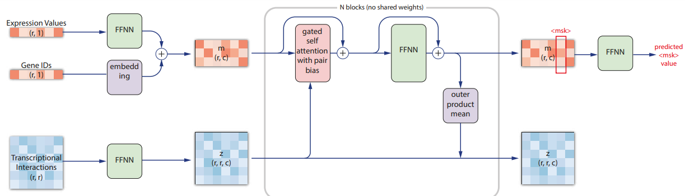
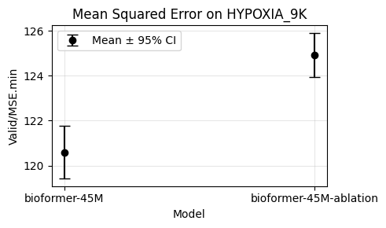

# 🧬 Bio-LLMs
Exploring Large Language Models for Gene Expression prediction.  

We developed a novel architecture dubbed BioFormer, which combines the encodings from scGPT with the EvoFormer module from AlphaFold 2. 

BioFormer can reason on both sequence-based and pair representations of RNA expression values, effectively capturing gene interactions. Moreover, initializing the pair representation with known regulatory interactions allows us to inject prior knowledge into the model.  

## Results
Bioformer is better than a transformer encoder with 95% confidence:

## To-do
- add Transition also on lower path
- add pair-wise specific modules (e.g. triangular self-attention)

## References
- [scGPT: toward building a foundation model for single-cell multi-omics using generative AI](https://www.nature.com/articles/s41592-024-02201-0)
- [Highly accurate protein structure prediction with AlphaFold](https://www.nature.com/articles/s41586-021-03819-2)